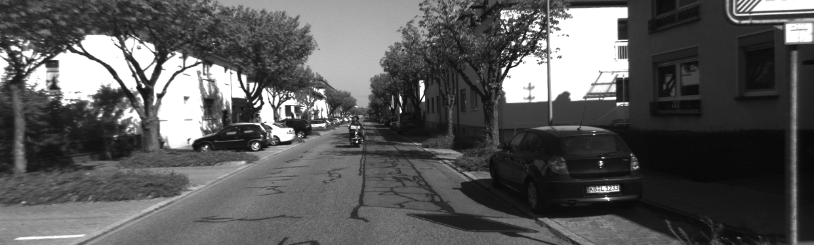

# Stereo-Point-Cloud
3D reconstruction using stereo image pair

## 1. Stereo Image Pair
**Left Image:**

**Right Image:**

## 2. Disparity Map
The computed disparity map:

## 3. Point Cloud Outputs
Generated point cloud visualizations:

**Point Cloud 1:**

**Point Cloud 2:**

**Point Cloud 3:**

# Interactive Point Cloud

<iframe width="800" height="600" src="
 <iframe title="point_cloud_result" frameborder="0" allowfullscreen mozallowfullscreen="true" webkitallowfullscreen="true" allow="autoplay; fullscreen; xr-spatial-tracking" xr-spatial-tracking execution-while-out-of-viewport execution-while-not-rendered web-share src="https://sketchfab.com/models/d4f985910f1b4db3b793f65844a98f4a/embed"> </iframe> 
 <a href="https://sketchfab.com/3d-models/point-cloud-result-d4f985910f1b4db3b793f65844a98f4a?utm_medium=embed&utm_campaign=share-popup&utm_content=d4f985910f1b4db3b793f65844a98f4a" target="_blank" rel="nofollow" style="font-weight: bold; color: #1CAAD9;"> point_cloud_result </a> by <a href="https://sketchfab.com/vedant047?utm_medium=embed&utm_campaign=share-popup&utm_content=d4f985910f1b4db3b793f65844a98f4a" target="_blank" rel="nofollow" style="font-weight: bold; color: #1CAAD9;"> vedant047 </a> on <a href="https://sketchfab.com?utm_medium=embed&utm_campaign=share-popup&utm_content=d4f985910f1b4db3b793f65844a98f4a" target="_blank" rel="nofollow" style="font-weight: bold; color: #1CAAD9;">Sketchfab</a>

" frameborder="0" allowfullscreen></iframe>

